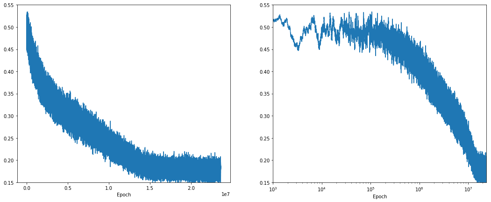

# FPMC

Implementation of Factorating Personalized Markov Chains for Next-Basket Prediction by S. Rendle, C. Freudenthaler and L. Schmidt-Thieme for Instacart Market Basket Analysis contest (https://www.kaggle.com/c/instacart-market-basket-analysis). Unfortunately, quality of predictions is very poor and it wasn't useful.

## Repo content:
<ul>
<li> FPMC.py  - main class;
<li> test_FPMC.py  -  Unit tests for FPMC class;
<li> teachModel.py  -  script for the model learning and validation;
<li> validateModel.py  -  validate the model and calculate F1 score.
</ul>

Learning rate:

